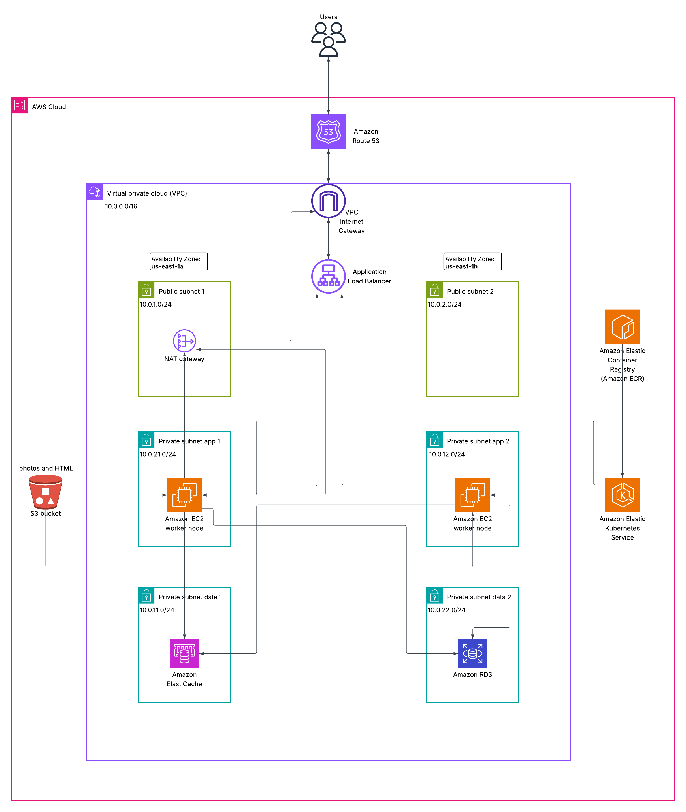

# Cloud-Native Status Page Deployment
A highly available, decoupled Status Page application deployed on AWS using a modern Cloud-Native and Infrastructure as Code (IaC) approach. 
This project demonstrates a complete DevOps lifecycle, from containerization to infrastructure provisioning and Kubernetes orchestration, ensuring security, scalability, and high availability.

## Architecture Overview

The application is built using a Microservices-style pattern based on a single mutable Docker image, orchestrated via Kubernetes, and backed by fully managed AWS services.

* **Frontend/Web Tier:** Handled by Kubernetes Pods running Gunicorn, exposed to the internet via an AWS Application Load Balancer (ALB).
* **Asynchronous Processing:** Background tasks and scheduling are decoupled using `rqworker` and `rqscheduler`, running in dedicated Kubernetes Pods.
* **Data Tier:** Relational data is stored securely in AWS RDS (PostgreSQL), while task queues and caching are managed by AWS ElastiCache (Redis).
* **Static Assets:** Logos, CSS, and UI assets are offloaded to an AWS S3 Bucket to reduce Pod load and improve performance.

## Key DevOps & Cloud Features
* **Infrastructure as Code (IaC):** AWS infrastructure is provisioned and managed using **Terraform**.
* **Zero-Trust Security:** Strict AWS Security Groups are implemented. The Database and Cache tiers are completely isolated in private subnets and accept traffic *only* from the Application Security Group.
* **Container Orchestration:** Deployed on Amazon EKS (Elastic Kubernetes Service).
* **Resource Efficiency:** Utilizes a single Docker `Dockerfile` for the entire stack. Kubernetes deployment manifests override the container `command` entrypoint to dynamically assign roles (App, Worker, Scheduler) without bloating the ECR registry.

##  Technologies Used
* **Cloud Provider:** AWS (EKS, RDS, ElastiCache, S3, ECR, ALB, VPC)
* **Infrastructure as Code:** Terraform
* **Containerization:** Docker
* **Orchestration:** Kubernetes (kubectl)
* **Application Stack:** Python, Django, Redis Queue (RQ), Gunicorn

##  Infrastructure Components 
* **VPC:** Custom VPC (10.0.0.0/16) with public/private subnets across 2 AZs
* Public Subnets: 10.0.1.0/24, 10.0.2.0/24 (for Load Balancers and NAT Gateway)
* Private Subnets: 10.0.21.0/24, 10.0.12.0/24 (for application nodes)
* Private Subnets: 10.0.11.0/24, 10.0.22.0/24 (for RDS and Elasticache)
* **Application Load Balancer (ALB):** Managed traffic routing for the application
    * Routing: Distributes incoming HTTP/HTTPS traffic across multiple target groups
    * Health Checks: Automatic monitoring of instance/pod availability
* **Internet Gateway (IGW):** Provides internet connectivity to public subnets
* **NAT Gateway:** Single NAT Gateway with Elastic IP for private subnet internet access
* **Amazon EKS Cluster:** Managed Kubernetes (v1.35) with 3 SPOT worker nodes (t3.medium)
    * Private subnets deployment for enhanced security
    * Auto Scaling Group with desired: 3, min: 2, max: 4
* **Amazon ECR:** Fully managed Docker container registry
    * Private repositories for secure image storage
    * Automated cleanup of old or unused images to optimize costs
    * Image scanning enabled for vulnerability detection
* **Amazon RDS for PostgreSQL:** Managed relational database service
    * Engine: PostgreSQL 15 (High-performance open-source database)
    * Multi-AZ deployment for failover and high availability
    * Isolated within private subnets
* **S3 Bucket:** Secure and scalable object storage
    * Hosted application assets and static files
    * S3 Block Public Access enabled
    * Policy: Restricted access via IAM roles and Bucket Policies
* **Amazon ElastiCache (Redis):** Fully managed in-memory data store
    * Used as a high-performance caching layer and session store
    * Sub-millisecond latency for real-time data access
    * Clustered mode enabled for seamless horizontal scaling
    * Automated snapshots for data durability and recovery

## Network Security
* VPC: Isolated network environment (10.0.0.0/16)
* Security Groups: Least-privilege access between components
* Private Subnets: Database and cache in private subnets only
* Secrets Management: AWS Secrets Manager

## Prerequisites
* AWS CLI 
* Terraform 
* Kubectl
* Docker
* Git

## Repository Structure
* `/Terraform-files/` - Contains all Terraform (`.tf`) files to provision the AWS infrastructure (VPC, EKS, RDS, ElastiCache, S3, Security Groups).
* `/EKS-deployments-files/` - Contains Kubernetes manifests (`deployment.yaml`, `service.yaml`) for the Web App, Worker, and Scheduler.
* `/statuspage/` - Application source code and `Dockerfile`.

## Deployment Guide

### 1. GitHub Repository Setup
clone the repository
```bash
git clone https://github.com/yoav31/status-page-project.git
cd status-page-project
```
### 2. Provision Infrastructure
Navigate to the Terraform directory and deploy the AWS resources (not forget to edit the names):
```bash
cd Terraform-files
terraform init
terraform plan
terraform apply
cd ..
```
### 3. CI/CD Configuration 
Run Jenkins Container:
```bash
sudo systemctl start docker
docker run -d \
    -p 8080:8080 -p 50000:50000 \
    -v /var/run/docker.sock:/var/run/docker.sock \
    -v jenkins_home:/var/jenkins_home \
    --name jenkins-server jenkins/jenkins:lts
```

### 4. Initial Jenkins Setup
1. **Start Jenkins:** Run the `docker run` command provided above.
2. **Unlock Jenkins:** Use `docker logs jenkins-server` to get the admin password.
3. **Create Job:** * Click **New Item** -> **Pipeline**.
   * Name it `status-page-pipeline`.
4. **Link Jenkinsfile:** * Under **Pipeline**, paste your `Jenkinsfile` code.
5. **Run:** The **Build Now** button will now be available on the left sidebar.

### 5. Deploy Application 
Option A: automatic deployment with Jenkins pipeline
```bash
git add .
git commit -m "Initial deployment configuration"
git push origin main  
```
Option B: manual initial deployment with bash script
```bash
cd status-page-project
chmod +x deploy-image.sh
./deploy.sh
```

##  Monitoring Stack
Option A: Install with Helm manualy
```bash
cd Grafana
kubectl create namespace monitoring
helm repo add prometheus-community https://prometheus-community.github.io/helm-charts
helm repo add grafana https://grafana.github.io/helm-charts
helm repo update
helm install kube-stack prometheus-community/kube-prometheus-stack \
  --namespace monitoring \
  --set grafana.adminPassword="admin" \
  --set grafana.service.type=ClusterIP \
  --set prometheus.service.type=ClusterIP \
  -f grafana-values.yaml
helm install loki-stack grafana/loki-stack \
  --namespace monitoring \
  --values loki-values.yaml \
  --set loki.service.type=ClusterIP \
  --set promtail.enabled=true
echo "Waiting for pods to be ready..."
kubectl get pods -n monitoring -w
cd ..
```
Option B: manual initial deployment with bash script
```bash
chmod +x setup-monitoring.sh
./setup-monitoring.sh
```

#### Deploy Grafana dashboard and alerts

```bash
chmod +x deploy-grafana-config.sh
./deploy-grafana-config.sh
```
#### Starting port-forward to Grafana
```bash
kubectl port-forward -n monitoring svc/kube-stack-grafana 3000:80
```
enter the url in your browser:
```bash
http://localhost:3000
```
* **Default Credentials:** User: `admin`, Password: `admin` (can be changed in the Helm install command).

#### Telegram Alerts
* The system is pre-configured to send critical alerts (High CPU, Pod Down) to a Telegram bot.
* You can modify the `bottoken` and `chatid` in `Grafana/contact-points.yaml` before running the deployment script.

## Verification Checklist
Verify everything is working:
```bash
# ✓ All pods running
kubectl get pods -A | grep -v Running

# ✓ Application accessible
kubectl get svc status-page-service

# ✓ Database connectivity
kubectl exec -it $(kubectl get pods -l app=status-page -o jsonpath='{.items[0].metadata.name}') -- python manage.py dbshell -c "SELECT 1;"

# ✓ Redis connectivity  
kubectl exec -it $(kubectl get pods -l app=status-page -o jsonpath='{.items[0].metadata.name}') -- python -c "import redis; r=redis.Redis(host='YOUR_REDIS_ENDPOINT', ssl=True); print(r.ping())"
```

## Troubleshooting
### Common Issues
* **Pod Stuck in ContainerCreating:** Check for issues with pulling images from ECR or resource constraints.
* **Database/Redis Connection Issues:** Ensure Security Groups allow traffic between the App SG and the RDS/Redis SGs.
* **Logs Analysis:**
  ```bash
  kubectl logs -f deployment/status-page-app
  kubectl logs -f deployment/status-page-worker
  kubectl logs -f deployment/status-page-scheduler
  ```

## Maintenance
* **Updating Application:** Push new code, build and push image to ECR, and run `kubectl rollout restart deployment status-page-app`.
* **Database Maintenance:** RDS handles automated backups and maintenance windows.
* **Scaling:** Adjust replicas in `EKS-deployments-files/deployment.yaml` and apply.

## Cleanup
To avoid incurring AWS costs, remember to destroy the infrastructure when finished:
```bash
cd Terraform-files
terraform destroy -auto-approve
```
## Estimated costs of the project for single month 
* **EKS:** 72$
* **EC2 Instances:** 3x t3.medium ~ 90$
* **RDS:** t4.micro ~14$
* **ElastiCache:** t3.medium ~ 50$
* **ALB:** ~ 18$
* **ECR & S3:** ~10$
### total cost:  ~254$


